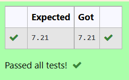

# DISTANCE-BETWEEN-TWO-POINTS

## AIM:
To write a python program to find the distance two 2 points
## ALGORITHM:
### Step 1: 
first step is to python to import math 
### Step 2: 
initialize the two list l1,l2 with two elements each
### Step 3: 
Substitute the values in the distance formula  
### Step 4: 
format the distance to two decimal places
### Step 5: 
print the formatted distance

### PROGRAM:

```python

#Program to find the distance between two points.
#Developed by: Ashwin kumar.S
#RegisterNumber:22000974

import math
l2=[10,6]
l1=[4,2]
dist=math.sqrt(((l2[0]-l1[0])**2)+((l2[1]-l1[1])**2))
print("{:.2f}".format(dist))

```
  


### OUTPUT:



### RESULT:
By this program we able to find the distance between two points
